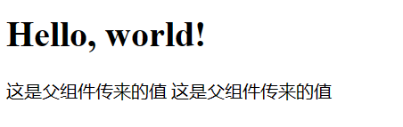
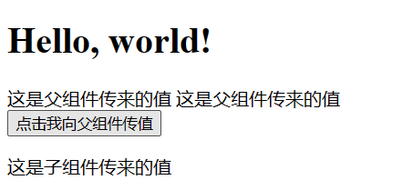
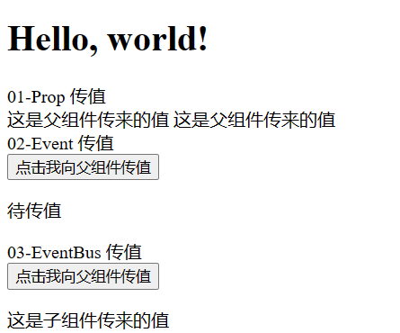
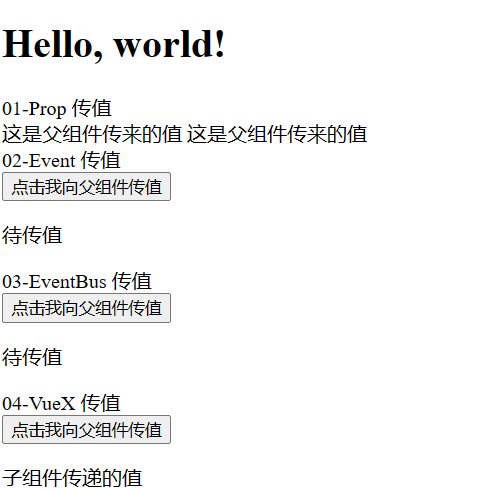
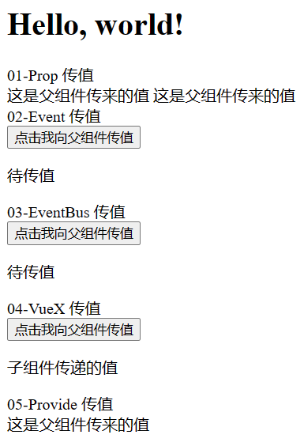
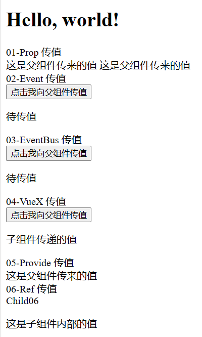
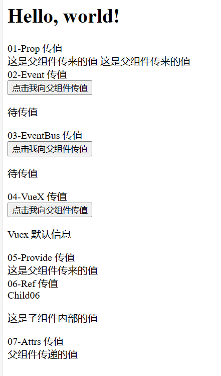

# 【每日前端面经】2024-03-15

## 本期重点——组件通信

欢迎订阅我的前端面经专栏: [每日前端面经](https://blog.csdn.net/m0_66681776/category_12583217.html)

```txt
Tips:

每日面经更新从 2-22 到 3-15 已有 23 篇，最近愈发觉得内容相似度高，并且理解程度不深  
于是临时停更面经，并将这些面经中的重难点以项目实战的方式展现出来供读者参阅

极简 Vue 模板：https://github.com/xxhls/vue-mini-template  
本期项目地址：https://github.com/xxhls/vue-mini-template
```

### 通信方式概要

- Props / 组件属性
- Custom Events / 自定义属性
- Event Bus / 事件总线
- VueX / 状态管理
- Provide & Inject / 依赖注入
- Ref & Reactive
- useAttrs
- Pinia

### 逐一详解

#### Props / 组件属性

Props 主要用于 `父组件 -> 子组件`

```html
<!-- 父组件 -->
<script setup lang="ts">
import Child01 from './01-Props/Child01.vue';
</script>

<template>
    <h1>Hello, world!</h1>

    <!-- Prop 传值 -->
    <Child01 msg="这是父组件传来的值" />
</template>
```

```html
<!-- 子组件 -->
<script setup lang="ts">
defineProps<{
    msg: string
}>();
</script>

<template>
    <div>
        这是父组件传来的值 {{ msg }}
    </div>
</template>
```



#### Custom Events / 自定义事件

1. 在子组件内使用 defineEmits 定义自定义事件
2. 在子组件事件中通过 emit 触发自定义事件并传值
3. 父组件通过 v-on 绑定子组件自定义事件的处理函数
4. 在函数中可以取到子组件传来的值

```html
<!-- 父组件 -->
<script setup lang="ts">
import Child02 from './02-Events/Child02.vue';

import { ref } from 'vue';

const value02 = ref('');
const handleEvent = (val: string) => {
    value02.value = val;
};
</script>

<template>
    <h1>Hello, world!</h1>

    <!-- Event 传值 -->
    <Child02 @myEvent="handleEvent" />
    <p>{{ value02 === '' ? '待传值' : value02 }}</p>
</template>

```

```html
<!-- 子组件 -->
<script setup lang="ts">
import { defineEmits } from 'vue';

const emit = defineEmits(['myEvent']);

const handleClick = () => {
    emit('myEvent', '这是子组件传来的值');
};
</script>

<template>
    <div>
        <button @click="handleClick">点击我向父组件传值</button>
    </div>
</template>

```



#### Event Bus / 事件总线

由于 vue3 没有提供全局绑定的 $on 和 $emit，所以需要安装第三方库来实现

```shell
pnpm install mitt
```

```ts
// EventBus.ts
import mitt from 'mitt'
 
type Events = {
  sendMsg: string
}
 
const bus = mitt<Events>()
export default bus
```

```html
<!-- 父组件 -->
<script setup lang="ts">
import Child03 from './03-EventBus/Child03.vue';
import bus from './03-EventBus/EventBus';

import { ref } from 'vue';

const value03 = ref('');
bus.on('sendMsg', (val: string) => {
    value03.value = val;
});
</script>

<template>
    <h1>Hello, world!</h1>

    03-EventBus 传值
    <Child03 />
    <p>{{ value03 === '' ? '待传值' : value03 }}</p>
</template>

```

```html
<!-- 子组件 -->
<script setup lang="ts">
import bus from './EventBus';

const handleClick = () => {
    bus.emit('sendMsg', '这是子组件传来的值');
};
</script>

<template>
    <div>
        <button @click="handleClick">点击我向父组件传值</button>
    </div>
</template>
```



#### VueX / 状态管理

1. 安装 `pnpm install vuex@next`
2. 创建 VueX 仓库
3. 挂载 VueX 仓库
4. 父组件订阅数据
5. 子组件发布事件

```ts
// vuex.ts
import { createStore } from 'vuex'

const VuexStore = createStore({
  state () {
    return {
      msg: 'Vuex 默认信息'
    }
  },
  mutations: {
    updateMsg (state: any, msg: string) {
      state.msg = msg
    }
  }
});

export default VuexStore;
```

```ts
// main.ts
import { createApp } from "vue";
import App from "./App.vue";

import VuexStore from "./04-VueX/vuex";

const app = createApp(App);

app.use(VuexStore);

app.mount("#app");
```

```html
<!-- 父组件 -->
<script setup lang="ts">
import Child04 from './04-VueX/Child04.vue';

</script>

<template>
    <h1>Hello, world!</h1>

    04-VueX 传值
    <Child04 />
    <p>{{ $store.state.msg }}</p>
</template>
```

```html
<!-- 子组件 -->
<script setup lang="ts">
</script>

<template>
    <div>
        <button @click="$store.commit('updateMsg', '子组件传递的值')">点击我向父组件传值</button>
    </div>
</template>
```



#### Provide & Inject / 依赖注入

在父组件通过 `provide(名称, 值);` 向下传递依赖  
在子组件通过 `const msg = inject(名称);` 将依赖注入到组件内

```html
<!-- 父组件 -->
<script setup lang="ts">
import Child05 from './05-Provide/Child05.vue';

import { provide } from 'vue';

provide('msg', '这是父组件传来的值');
</script>

<template>
    <h1>Hello, world!</h1>

    05-Provide 传值
    <Child05 />
</template>
```

```html
<!-- 子组件 -->
<script setup lang="ts">
import { inject } from 'vue';

const msg = inject('msg');
</script>

<template>
    <div>
        {{ msg }}
    </div>
</template>
```



#### Ref & Reactive / 实例传递

子组件通过 expose 向外暴露数值，父组件通过 ref 获取子组件实例得到传递的值  
由于父组件会在子组件挂载之前读取值，会导致 null 错误，因此采用 watch 的方式监听 ref 然后更新视图

```html
<!-- 父组件 -->
<script setup lang="ts">
import Child06 from './06-Ref/Child06.vue';

import { ref, watch } from 'vue';

const child06Ref = ref<typeof Child06 | null>(null);
const value06 = ref('');
watch(child06Ref, (val) => {
    value06.value = val?.msg;
});
</script>

<template>
    <h1>Hello, world!</h1>

    06-Ref 传值
    <Child06 ref="child06Ref" />
    <p>{{ value06 }}</p>
</template>
```

```html
<!-- 子组件 -->
<script setup lang="ts">
const msg = '这是子组件内部的值';

defineExpose({ msg });
</script>

<template>
    <div>Child06</div>
</template>
```



#### useAttrs / 属性获取

代替 props 传参，通过 useAttrs 获取全部的自定义属性

```html
<!-- 父组件 -->
<script setup lang="ts">
import Child07 from './07-Attrs/Child07.vue';

</script>

<template>
    <h1>Hello, world!</h1>

    07-Attrs 传值
    <Child07 value07="父组件传递的值" />
</template>
```

```html
<!-- 子组件 -->
<script setup lang="ts">
import { useAttrs } from 'vue';

const attrs = useAttrs();
</script>

<template>
    <div>{{ attrs.value07 }}</div>
</template>
```



#### Pinia / 状态管理

1. 安装 `pnpm install pinia`
2. 主函数挂载 pinia
3. 创建 pinia 仓库
4. 父组件调用仓库参数
5. 子组件触发仓库更新函数

```ts
// main.ts
import { createApp } from "vue";
import App from "./App.vue";
import { createPinia } from "pinia";

const app = createApp(App);

app.use(createPinia());

app.mount("#app");
```

```ts
// pinia.ts
import { ref } from 'vue'
import { defineStore } from 'pinia'

export const useMsgStore = defineStore('msg', () => {
    const msg = ref('Hello, Pinia!')
    function setMsg(__msg: string) {
        msg.value = __msg
    }

    return { msg, setMsg }
});
```

```html
<!-- 父组件 -->
<script setup lang="ts">
import { useMsgStore } from './08-Pinia/pinia';
import Child08 from './08-Pinia/Chind08.vue';

const piniaStore = useMsgStore();
</script>

<template>
    <h1>Hello, world!</h1>

    08-Pinia 传值
    <Child08 />
    <p>{{ piniaStore.msg }}</p>
</template>
```

```html
<script setup lang="ts">
import { useMsgStore } from './pinia';

const piniaStore = useMsgStore();

const handleClick = () => {
    piniaStore.setMsg('这是子组件传来的值');
};
</script>

<template>
    <div>
        <button @click="handleClick">传值</button>
    </div>
</template>
```
